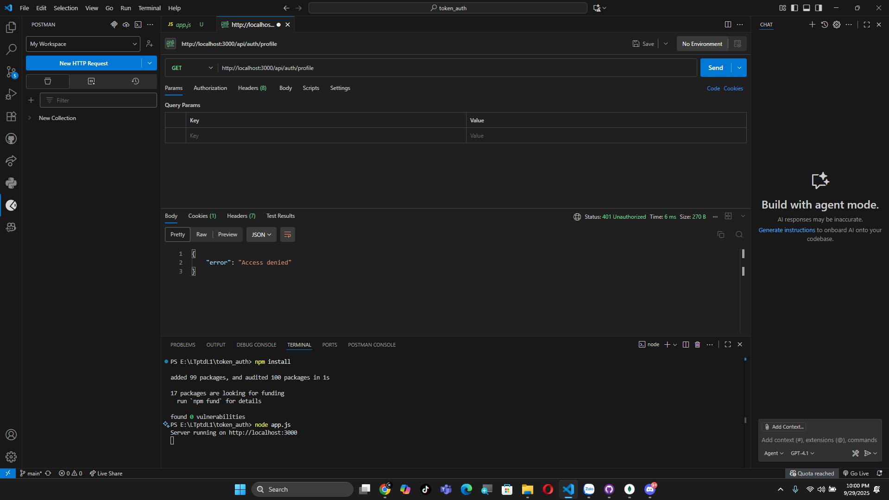
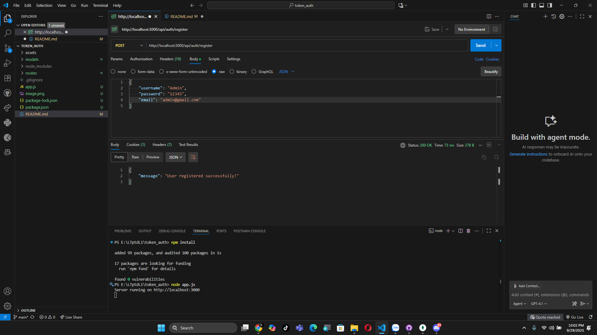
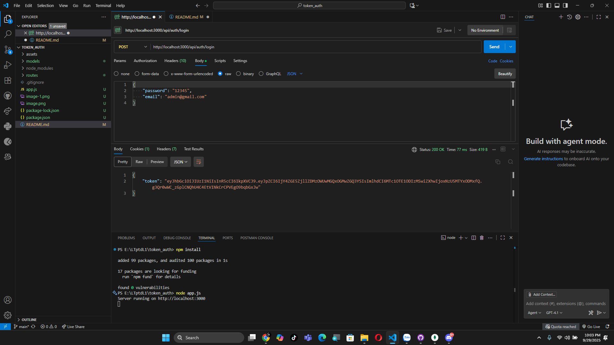

# 🔑 Token Authentication

---

## 📑 Quy trình demo

### 🚫 Truy cập profile khi chưa Login
- Hệ thống từ chối truy cập nếu chưa có token:  
  

---

### 📝 Đăng ký tài khoản
- Người dùng thực hiện đăng ký:  
  

---

### 🔐 Đăng nhập tài khoản
- Khi đăng nhập thành công, hệ thống trả về **token**:  
  

---

### 👤 Truy cập Profile bằng Token
- Người dùng gửi token trong **Authorization header** để lấy thông tin profile:  
  

---

✍️ *Demo phục vụ học tập về Token-based Authentication.*
